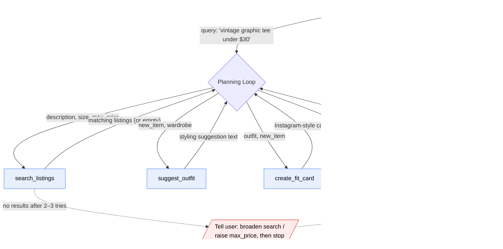

# FitFindr — planning.md

> Complete this document before writing any implementation code.
> Your spec and agent diagram are what you'll use to direct AI tools (Claude, Copilot, etc.) to generate your implementation — the more specific they are, the more useful the generated code will be.
> Your planning.md will be reviewed as part of your submission.
> Update it before starting any stretch features.

---

## Tools

List every tool your agent will use. For each tool, fill in all four fields.
You must have at least 3 tools. The three required tools are listed — add any additional tools below them.

### Tool 1: search_listings

**What it does:**
<!-- Describe what this tool does in 1–2 sentences -->
This tool searches the mock secondhand listings dataset for clothing items that match the user's requested description, size, and maximum price. It filters listings using the available fields in listings.json, including title, description, category, style tags, size, condition, price, colors, brand, and platform.

**Input parameters:**
<!-- List each parameter, its type, and what it represents -->
- `description` (str): A natural language description of the item the user is looking for, such as "vintage graphic tee" or "wide-leg denim jeans".
- `size` (str or None): The user's preferred size, such as "M", "S/M", or "W30 L30". If no size is provided, the search should not filter by size.
- `max_price` (float or None): The highest price the user is willing to pay. If provided, returned listings must have a price less than or equal to this value.

**What it returns:**
<!-- Describe the return value — what fields does a result contain? -->
Returns a list[dict] containing up to the top three matching listings. Each listing dictionary may include fields such as id, title, description, category, style_tags, size, condition, price, colors, brand, and platform.

**What happens if it fails or returns nothing:**
<!-- What should the agent do if no listings match? -->
If no matching listings are found, the tool returns an empty list [] instead of crashing. The agent will then tell the user that no listings matched their search and suggest a useful next step, such as broadening the item description, removing the size filter, or increasing the maximum price.
---

### Tool 2: suggest_outfit

**What it does:**
<!-- Describe what this tool does in 1–2 sentences -->
This tool takes a selected listing and the user's wardrobe, then suggests complete outfit combinations that include the new item. It uses available wardrobe details such as category, colors, style tags, and notes to create outfits that make sense with what the user already owns.

**Input parameters:**
<!-- List each parameter, its type, and what it represents -->
- `new_item` (dict): A dictionary representing the listing selected from search_listings. It may include fields such as id, title, category, style_tags, size, condition, price, colors, brand, and platform.
- `wardrobe` (dict): A dictionary representing the user's wardrobe. It contains wardrobe items with fields such as item name, category, colors, style tags, and notes.

**What it returns:**
<!-- Describe the return value -->
Returns a list[dict] containing up to three outfit suggestions. Each outfit dictionary includes the new item, selected wardrobe pieces, a short styling explanation, and any missing item suggestions if the wardrobe does not contain enough pieces for a full outfit.

**What happens if it fails or returns nothing:**
<!-- What should the agent do if the wardrobe is empty or no outfit can be suggested? -->
If the wardrobe is empty or too minimal, the tool still returns a useful styling suggestion using the new item by itself. It should explain what type of pieces the user could add, such as jeans, sneakers, boots, or accessories, instead of crashing or returning nothing.

---

### Tool 3: create_fit_card

**What it does:**
<!-- Describe what this tool does in 1–2 sentences -->
This tool turns the selected outfit suggestion into a short, shareable outfit caption. The caption should sound casual, stylish, and social-media-ready rather than like a product description.

**Input parameters:**
<!-- List each parameter, its type, and what it represents -->
- `outfit` (dict): The outfit suggestion selected from suggest_outfit. It includes the new item, wardrobe pieces, and styling explanation.
- `new_item` (dict): The listing selected from search_listings, used to reference details like item title, price, platform, brand, color, or style.

**What it returns:**
<!-- Describe the return value -->
Returns a str containing a short outfit caption or fit card. The output should vary depending on the outfit and new item so different inputs produce different captions.

**What happens if it fails or returns nothing:**
<!-- What should the agent do if the outfit data is incomplete? -->
If the outfit is empty, missing, or incomplete, the tool returns a clear error message string explaining that a fit card cannot be created without a valid outfit. The agent should only call this tool after suggest_outfit successfully returns an outfit suggestion.

## Planning Loop

**How does your agent decide which tool to call next?**
<!-- Describe the logic your planning loop uses. What does it look at? What conditions change its behavior? How does it know when it's done? -->
## Planning Loop

The agent first calls `search_listings(description, size, max_price)` using the user's query.

If `search_listings` returns an empty list, the agent stores an error message in the session and stops. The user is advised to broaden their description, remove the size filter, or increase their maximum price.

If results are found, the agent stores the top result as `selected_item` and calls `suggest_outfit(selected_item, wardrobe)`.

If `suggest_outfit` cannot generate an outfit, the agent stores an error message and stops. Otherwise, the outfit suggestions are stored in the session and the first outfit is selected.

The agent then calls `create_fit_card(selected_outfit, selected_item)`.

If a fit card is successfully generated, it is stored in the session and returned to the user. If not, an error message is stored and returned.

The workflow ends when either an error occurs or a fit card is successfully created.

---

## State Management

**How does information from one tool get passed to the next?**
<!-- Describe how your agent stores and accesses state within a session. What data is tracked? How is it passed between tool calls? -->
The agent uses a session dictionary to store information between tool calls. After `search_listings` returns results, the top listing is saved as `session["selected_item"]`. That saved item is then passed into `suggest_outfit` with the user’s wardrobe.

After `suggest_outfit` returns outfit suggestions, they are saved as `session["outfit_suggestions"]`. The first suggestion is saved as `session["selected_outfit"]` and passed into `create_fit_card` with `session["selected_item"]`.

The session also tracks `session["fit_card"]` for the final caption and `session["error"]` if any step fails. This lets the agent continue using earlier tool outputs without asking the user to re-enter the same information.

---

## Error Handling

For each tool, describe the specific failure mode you're handling and what the agent does in response.

| Tool | Failure mode | Agent response |
|------|-------------|----------------|
| search_listings | No results match the query | Tell the user no matches were found and suggest what to adjust (broaden the description or raise `max_price`). Retry on the adjusted query up to 2–3 times; if it still returns nothing, report the item as unavailable and stop. Do **not** call `suggest_outfit` — the flow terminates here. |
| suggest_outfit | Wardrobe is empty | Detect the empty `items` list and ask the user to enter wardrobe pieces before continuing. Do not call `suggest_outfit` with an empty wardrobe; once items are provided, resume from this step. |
| create_fit_card | Outfit input is missing or incomplete | Check that both `selected_item` and `selected_outfit` exist in session before calling. If either is missing, do not generate a caption — fall back to the most recent valid step (re-run `suggest_outfit`) or report that no fit card can be created yet. |

---

## Architecture

<!-- Draw a diagram of your agent showing how the components connect:
     User input → Planning Loop → Tools (search_listings, suggest_outfit, create_fit_card)
                                                                          ↕
                                                                   State / Session
     Show what triggers each tool, how state flows between them, and where error paths branch off.
     ASCII art, a Mermaid diagram (https://mermaid.js.org/syntax/flowchart.html), or an embedded
     sketch are all fine. You'll share this diagram with an AI tool when asking it to implement
     the planning loop and each individual tool. -->

**How to read it:**
- The **Planning Loop** is the controller — it calls each tool in sequence and reads/writes **Session State** between calls (the `selected_item` from `search_listings` is what gets passed into `suggest_outfit`, and so on).
- Solid arrows are the **happy path**: search → suggest → fit card → output.
- The **dotted error branch** off `search_listings` is where the flow terminates early: if no listings match after a couple of retries, the agent tells the user what to adjust and stops — `suggest_outfit` is never called with empty input.

---

## AI Tool Plan

<!-- For each part of the implementation below, describe:
     - Which AI tool you plan to use (Claude, Copilot, ChatGPT, etc.)
     - What you'll give it as input (which sections of this planning.md, your agent diagram)
     - What you expect it to produce
     - How you'll verify the output matches your spec before moving on

     "I'll use AI to help me code" is not a plan.
     "I'll give Claude my Tool 1 spec (inputs, return value, failure mode) and ask it to implement
     search_listings() using load_listings() from the data loader — then test it against 3 queries
     before trusting it" is a plan. -->

**Milestone 3 — Individual tool implementations:**

**Tool:** I'll use **Claude (Claude Code)** to implement each of the three tools.

**Input I'll give it:** For each tool, the matching block from my **Tools** section (inputs, return value, failure mode) plus the relevant row from the **Error Handling** table. I'll also point it at `utils/data_loader.py` and the field lists in `data/listings.json` and `data/wardrobe_schema.json` so it filters/reads the real fields instead of inventing them.

- `search_listings` → "Implement `search_listings(description, size, max_price)` using `load_listings()` from the data loader. Filter on `size`, `price <= max_price`, and match `description` against `title`/`description`/`style_tags`. Return matches sorted by relevance; return an empty list when nothing matches."
- `suggest_outfit` → "Implement `suggest_outfit(new_item, wardrobe)` taking a listing dict and a wardrobe dict in the `wardrobe_schema.json` format. Return a styling-suggestion string. If `wardrobe['items']` is empty, signal that so the loop can ask the user for wardrobe pieces."
- `create_fit_card` → "Implement `create_fit_card(outfit, new_item)` that returns a short Instagram-style caption from the approved outfit and item."

**What I expect it to produce:** Three standalone Python functions that use the data loader (not re-reading files), match my exact signatures, and handle the empty/failure cases from my table.

**How I'll verify before moving on:**
- `search_listings`: test 3 queries — one that should match (e.g. graphic tee under $30), one with `max_price` too low (expect empty list), and one with a size that doesn't exist (expect empty list). Confirm sorting and that it never errors on no matches.
- `suggest_outfit`: run once with `get_example_wardrobe()` (expect a real suggestion) and once with `get_empty_wardrobe()` (expect the empty-wardrobe signal, not a crash).
- `create_fit_card`: run with a valid item + outfit (expect a caption) and with a missing field (expect the guard, not a malformed caption).

**Milestone 4 — Planning loop and state management:**

**Tool:** **Claude (Claude Code)**, given my **Architecture** diagram, **Planning Loop**, and **State Management** sections.

**Input I'll give it:** The agent diagram (so it sees the call order and the error branch), the State Management section (the `session` keys: `selected_item`, `outfit_suggestions`, `selected_outfit`, `fit_card`, `error`), and the three tool signatures from Milestone 3.

**What I expect it to produce:** A planning loop that calls `search_listings` first, stores the top result in `session["selected_item"]`, passes it into `suggest_outfit`, stores the suggestion, then calls `create_fit_card` — reading/writing the session dict between steps and branching to the early-termination error path when `search_listings` returns nothing.

**How I'll verify before moving on:**
- **Happy path:** run the full example query end-to-end and confirm all three tools fire in order and the final caption appears.
- **Error path:** run a query that returns no listings and confirm the loop stops after the retry/advice step and **never** calls `suggest_outfit`.
- **Empty wardrobe:** run with `get_empty_wardrobe()` and confirm the loop pauses to ask for wardrobe items instead of passing an empty wardrobe into `suggest_outfit`.
- Inspect the `session` dict after a run to confirm state was threaded between tools rather than re-derived.

---

## A Complete Interaction (Step by Step)

Write out what a full user interaction looks like from start to finish — tool call by tool call. Use a specific example query.

**Example user query:** "I'm looking for a vintage graphic tee under $30. I mostly wear baggy jeans and chunky sneakers. What's out there and how would I style it?"

**Step 1:**
<!-- What does the agent do first? Which tool is called? With what input? -->
The agent calls `search_listings(description="vintage graphic tee", size=None, max_price=30.0)`. (No size was given in the query, so `size` is left out.) It returns a list of matching listings sorted by relevance — e.g. the top match is the **"Y2K Baby Tee — Butterfly Print"** (`id: lst_002`, $18, size S/M, condition excellent, tags `["y2k", "vintage", "graphic tee", ...]`, platform depop). The agent saves the top result as `session["selected_item"]`.

If `search_listings()` returns an empty list, the agent tells the user no matches were found and suggests broadening the description or raising `max_price`. After 2–3 retries with no results, it reports the item as unavailable and stops — it does **not** call `suggest_outfit()` with empty input.

**Step 2:**
<!-- What happens next? What was returned from step 1? What tool is called now? -->
With `session["selected_item"]` set, the agent calls `suggest_outfit(new_item=session["selected_item"], wardrobe=<user's wardrobe>)`. For this user the wardrobe contains the baggy straight-leg jeans (`w_001`) and chunky white sneakers (`w_007`) they mentioned, so the tool returns a styling-suggestion string such as: *"Wear it with your baggy straight-leg jeans and chunky white sneakers — tuck the front hem for shape and add the black denim jacket for a layered 90s look."* The agent stores this in `session["outfit_suggestions"]` and the first one in `session["selected_outfit"]`. If `wardrobe["items"]` is empty, the agent instead asks the user to enter wardrobe pieces and does not call `suggest_outfit()` on an empty wardrobe.

**Step 3:**
<!-- Continue until the full interaction is complete -->
The suggestion from `suggest_outfit()` is shown to the user. If they ask for a different look, the agent calls `suggest_outfit()` again to generate an alternative styling (updating `session["selected_outfit"]`). The loop ends when the user approves a suggestion (→ move to `create_fit_card()`) or declines to continue.

**Final output to user:**
<!-- What does the user actually see at the end? -->
Once an outfit is approved, the agent calls `create_fit_card(outfit=session["selected_outfit"], new_item=session["selected_item"])`, which returns a short Instagram-style caption saved to `session["fit_card"]`. The user sees something like: *"thrifted this y2k butterfly baby tee off depop for $18 and it's already my favorite — styled with my baggy jeans + chunky sneakers 🦋 full look in stories."* If either the item or outfit is missing from session, the agent does not generate a caption and falls back to re-running the prior step.
